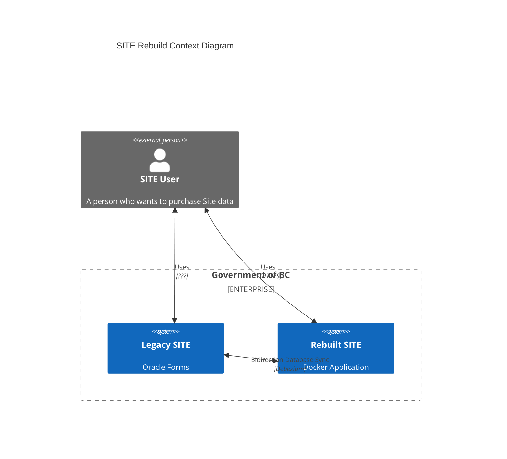
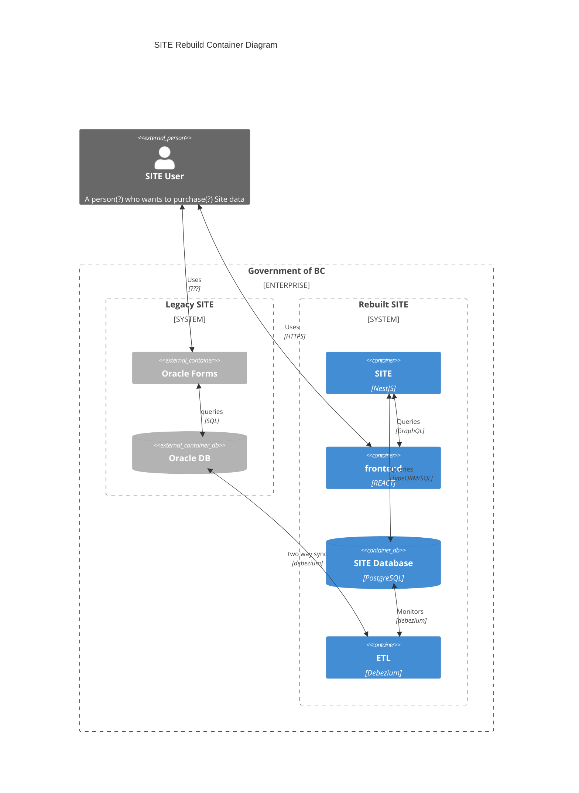

# SITE Registry Rebuild Architecture

## Context

The SITE rebuild aims to provide a new interface for the Site Registry by
creating a new application that performs a two way sync between its data store
and the data store of the legacy SITE.

