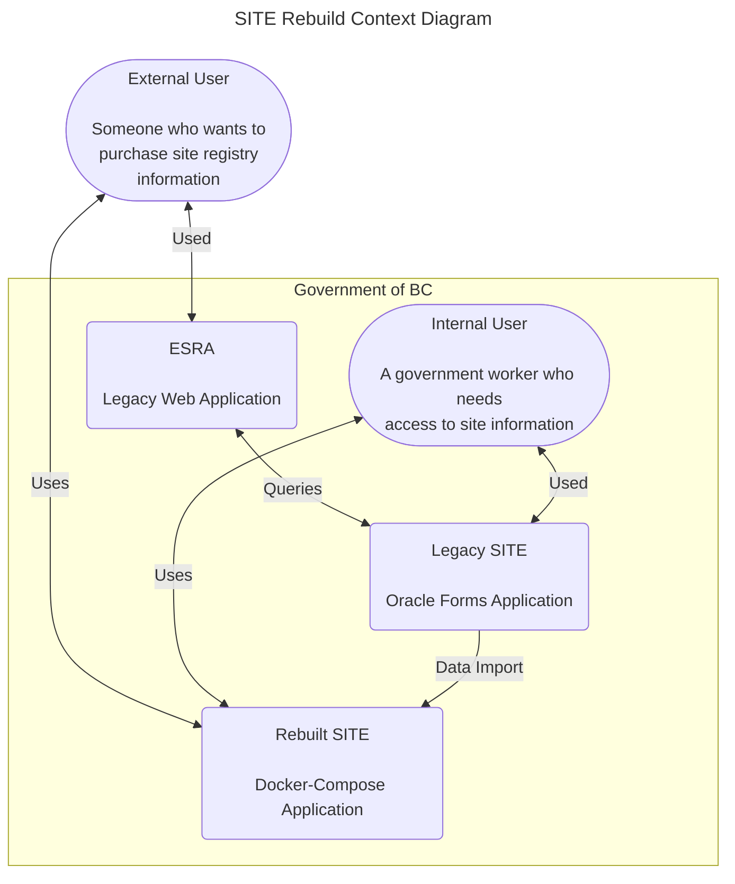
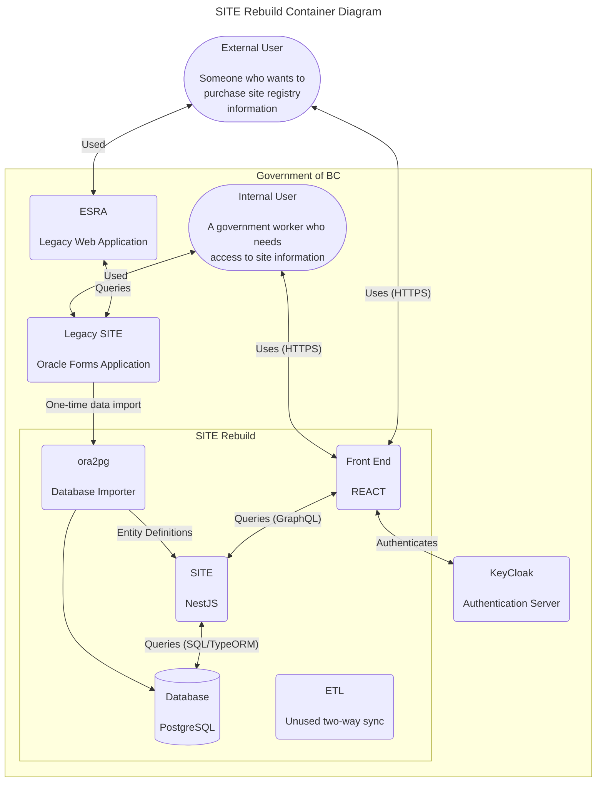
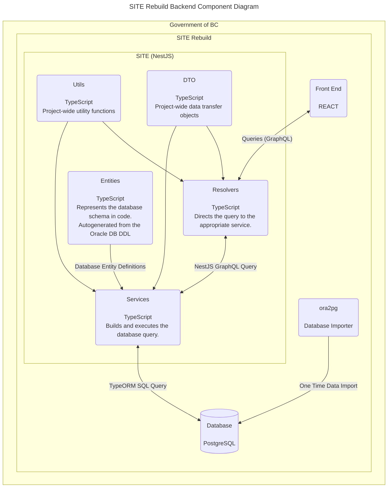
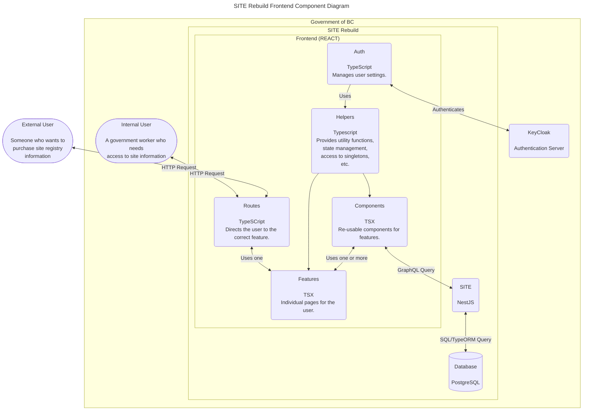

# SITE Registry Rebuild Architecture

## Context

The SITE rebuild aims to provide a new interface for the Site Registry by
creating a new application usable by both internal and external users.

```mermaid
---
title: SITE Rebuild Context Diagram
---
flowchart TB
  accTitle: SITE Rebuild Context Diagram
  accDescr: An overview of the uses of the SITE System

  ExtUser(["External User<br /><br />Someone who wants to<br />purchase site registry<br />information"])
  subgraph "Government of BC"
    Site("Rebuilt SITE<br /><br />Docker-Compose Application")
    Esra("ESRA<br /><br />Legacy Web Application")
    Legacy("Legacy SITE<br /><br />Oracle Forms Application")
    IntUser(["Internal User<br /><br />A government worker who needs<br />access to site information"])
  end
  ExtUser <--"Uses"--> Site
  ExtUser <--"Used"--> Esra
  Esra <--"Queries"--> Legacy
  IntUser <--"Used"--> Legacy
  IntUser <--"Uses"--> Site
  Legacy --"Data Import"--> Site
```

```mermaid
---
title: SITE Rebuild Container Diagram
---
flowchart TB
  accTitle: SITE Rebuild Container Diagram
  accDescr: This diagram details the individual services that make up the SITE Rebuild.

  ExtUser(["External User<br /><br />Someone who wants to<br />purchase site registry<br />information"])
  subgraph "Government of BC"
    IntUser(["Internal User<br /><br />A government worker who needs<br />access to site information"])
    subgraph "SITE Rebuild"
      Site("SITE<br /><br />NestJS")
      FrontEnd("Front End<br /><br />REACT")
      SiteDb[("Database<br /><br />PostgreSQL")]
      Etl("ETL<br /><br />Unused two-way sync")
      Ora2Pg("ora2pg<br /><br />Database Importer")

      FrontEnd <--"Queries (GraphQL)"--> Site
      Site <--"Queries (SQL/TypeORM)"--> SiteDb
      Ora2Pg --"Entity Definitions"--> Site
    end
    Esra("ESRA<br /><br />Legacy Web Application")
    Legacy("Legacy SITE<br /><br />Oracle Forms Application")
    KeyCloak("KeyCloak<br /><br />Authentication Server")

    FrontEnd <--"Authenticates"--> KeyCloak
    Legacy --"One-time data import"--> Ora2Pg --> SiteDb
  end

  ExtUser <--"Uses (HTTPS)"--> FrontEnd
  ExtUser <--"Used"--> Esra
  Esra <--"Queries"--> Legacy
  IntUser <--"Used"--> Legacy
  IntUser <--"Uses (HTTPS)"--> FrontEnd
```

```mermaid
---
title: SITE Rebuild Backend Component Diagram
---
flowchart TB
  accTitle: SITE Rebuild Backend Component Diagram
  accDescr: This diagram focuses on the backend component of the application

  subgraph "Government of BC"
    subgraph "SITE Rebuild"
      subgraph "SITE (NestJS)"
        Resolvers("Resolvers<br /><br />TypeScript<br />Directs the query to the appropriate service.")
        Services("Services<br /><br />TypeScript<br />Builds and executes the database query.")
        Entities("Entities<br /><br />TypeScript<br />Represents the database schema in code.<br />Autogenerated from the Oracle DB DDL")
        Utils("Utils<br /><br />TypeScript<br />Project-wide utility functions")
        Dto("DTO<br /><br />TypeScript<br />Project-wide data transfer objects")

        Resolvers <--"NestJS GraphQL Query"--> Services
        Entities --"Database Entity Definitions"--> Services
        Utils --> Services
        Utils --> Resolvers
        Dto --> Services
        Dto --> Resolvers
      end
      FrontEnd("Front End<br /><br />REACT")
      SiteDb[("Database<br /><br />PostgreSQL")]
      Ora2Pg("ora2pg<br /><br />Database Importer")

      FrontEnd <--"Queries (GraphQL)"--> Resolvers
      Services <--"TypeORM SQL Query"--> SiteDb
      Ora2Pg --"One Time Data Import"--> SiteDb
    end
  end
```

```mermaid
---
title: SITE Rebuild Frontend Component Diagram
---
flowchart TB
  accTitle: SITE Rebuild Frontend Component Diagram
  accDescr: This diagram focuses on the frontend component of the application

  ExtUser(["External User<br /><br />Someone who wants to<br />purchase site registry<br />information"])
  subgraph "Government of BC"
    IntUser(["Internal User<br /><br />A government worker who needs<br />access to site information"])

    subgraph "SITE Rebuild"
      Site("SITE<br /><br />NestJS")
      subgraph "Frontend (REACT)"
        Auth("Auth<br /><br />TypeScript<br />Manages user settings.")
        Components("Components<br /><br />TSX<br />Re-usable components for features.")
        Features("Features<br /><br />TSX<br />Individual pages for the user.")
        Helpers("Helpers<br /><br />Typescript<br />Provides utility functions,<br />state management,<br />access to singletons,<br />etc.")
        Routes("Routes<br /><br />TypeSCript<br />Directs the user to the correct feature.")

        Auth --"Uses"-->Helpers
        Routes <--"Uses one"--> Features
        Helpers --> Components
        Helpers --> Features
        Components <--"Uses one or more"--> Features
      end
      SiteDb[("Database<br /><br />PostgreSQL")]

      Site <--"SQL/TypeORM Query"--> SiteDb
      Components <--"GraphQL Query"--> Site
    end
    IntUser <--"HTTP Request"--> Routes
    KeyCloak("KeyCloak<br /><br />Authentication Server")

    Auth <--"Authenticates"--> KeyCloak
  end
  ExtUser <--"HTTP Request"--> Routes
```
