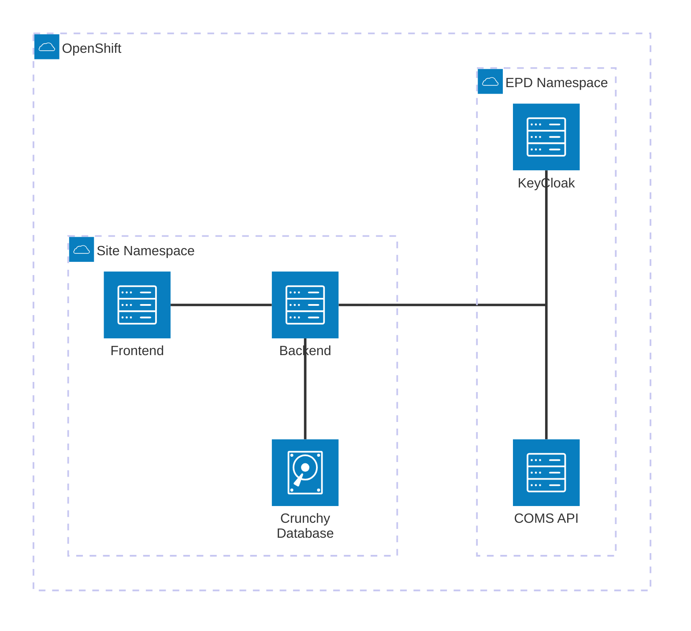
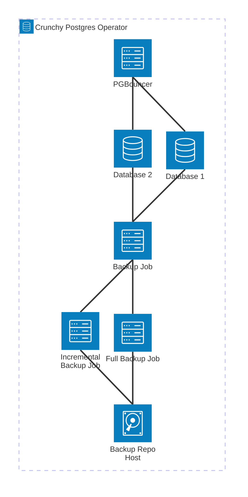
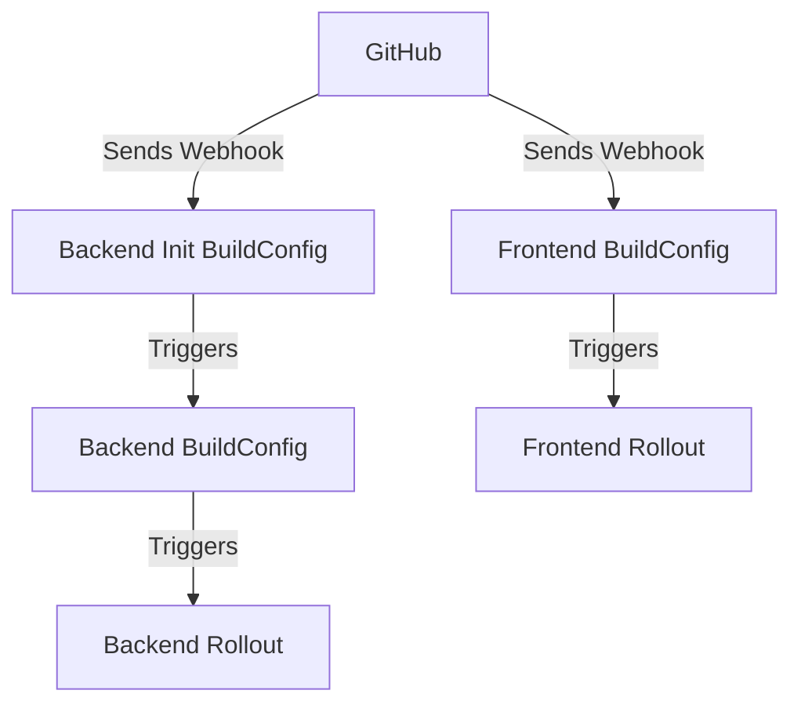

# OpenShift Operations Manual

The purpose of this document is to give an overview of how all of the SITE
Registry's services relate to one another, how to deploy them to a new OpenShift
namespace, and maintain them.

## Overview



### Front End and Back End Common features

#### Deployment

This is the entity that controls the actual pods that execute the actual code.

#### Horizontal Pod Autoscaler

Configures how the deployment should respond when it is under load. Horizontal
means that rather than throw more compute and memory at the pods (that would be
vertical scaling), it will create more pods to handle tasks in parallel. It
seems unlikely that we will experience much traffic so we can use a modest
configuration.

#### Pod Distruption Budget

This configures how the deployment responds to disruptions. It allows you to
select a minAvailable or maxUnavailable value. It is important to compare this
value to the number of pods that the deployment is targeting. If the PDB has a
minAvailable of 1, and the deployment targets 1 pod, then it is impossible to
restart the pod. For our use

#### Configuration

##### Config Map

This is used to inject environment variables, not the secret ones, into each
pod's execution environment.

##### Secrets

Defines what sensitive data is required. You'll either need to enter the secret
data directly through the web console, or use the `oc` tool.

#### Networking

Taken together the following three entities define how network traffic can flow
through the OpenShift cluster.

```
Internet -> Ingress -> Service -> Pods
                    ^
Network Policy enforces whether the caller
is allowed to reach the service/pod.
```

Note: Ingresses apply to HTTP(S) traffic only. All other traffic can ingress and
will be subject to the NetworkPolicy.

NOTE: It's unclear that the database has an externally available IP address.
Either it didn't and that was missed in the original iteration of the DevOps
setup, or there's something I'm unaware of. We may need to deploy an ingress
with an "edge" annotation just to have the database be publicly addressable.
This doesn't conflict with the earlier note about ingresses being HTTP only, but
is a quirk of our OpenShift setup that makes it different from a standard
Kubernetes cluster.

##### Ingress

This defines how network traffic is allowed into the OpenShift cluster from
outside..

##### Service

This defines the internal network of the openshift cluster. It provides internal
DNS and load balancing when directing network traffic to pods.

##### Network Policy

Kubernetes Network Policy. It provides rules for which network traffic is, and,
is not allowed. Very similar to a firewall, it takes both the caller, and
receiver into account when applying rules.

### Backend specific entities

#### BCGW Secret

We used to keep this separate from the PostgresCluster initialization. It's
unclear how this was shared and if it needs to be a fixed value. We can either
simply share the value that the PostgresCluster generates for its secret, or we
can re-introduce the secret and add changing the password to the db init script
if it's really necessary. I think it would be easier to just get a remote shell
to the primary database pod and change the password by hand since we won't be
initializing the production database more than once.

#### ESRA Cronjob

This triggers the backend deployment to generate the CSV file that allows it to
sync with external systems. It says ESRA, but I'm pretty sure its LTSA, which
ESRA also pulls from. This system is outside of our control. It is currently
unclear how we intend to integrate incoming changes. It's probably still work to
be done.

### Database

#### The Crunchy Postgres Operator

We don't really have any control over this because it's an openshift operator,
but for troubleshooting purposes, here is how it works.



In most cases, you want to route all database requests to the PGBouncer server.
There are some cases where there are known issues with PGBouncer (Prisma's
database migrator for example), and you will need to specify an alternate
connection directly to the primary database, for migrations only.

You can directly access the database by accessing a remote shell with
`oc -n <namespace> rsh pod/postgres-crunchy-db-<random-four-digit-code>` and run
a `psql` shell from there. Please do not do this in prod.

See the Devops handbook in confluence for more specific and advanced database
troubleshooting techniques.

#### PostgresCluster

This is the definition for the database. Note how it uses the Crunchy Postgres
Operator in the apiVersion.

#### ConfigMap

Defines the database configuration when it is first started.

#### KNP

TODO: lets rename this to something easier to understand

Kubernetes network policy. Permits network traffic from the backend pod to the
database.

#### PGBackRest Log Rotator

This is a job designed to address an
[upstream bug.](https://github.com/CrunchyData/postgres-operator/issues/4142)
where the database's storage will fill with hundreds of megabytes of logs. It
simply rotates the logs rather than allowing them to accumulate.

#### Database Seeding

TODO: Currently this is stored in the ora2pg dir. Is there any way we can
extract the OpenShift parts of this that would make sense?

In the ora2pg directory we have a script that will generate a standard SQL file
of insert statements to seed the database from the data contained in the legacy
Oracle database. It defines a PVC (storage), and a temporary pod to handle the
upload of the sql file to the PVC.

Currently the backend deploys this SQL file to the database every time a backend
pod is started (in the init container), which causes race conditions due to the
seeding script not being concurrency safe.

I want to migrate this process to a manually triggered pipeline.

#### BCGW Integration

This enables the BC Geographic Warehouse to pull data from the Site Registry. It
consists of the following entities:

- bcgw-tsc: Tranport Service Claim. This is the network ingress.
- bcgw-service: Service definition granting it network access to the database
- knp-bcgw: Kubernetes Network Policy. Configures the firewall to allow network
  access.

## Operation

Put stuff here that describes how to deploy/redeploy the services.

Deploy steps short version:

1. Apply Imagestreams and BuildConfigs
   1. Apply the ImageStreams and BuildConfigs to the tools namespace.
   2. Run all of the builds to push images.
2. Deploy the database
   1. Apply ConfigMap, NetworkPolicy, Secret
   2. Fill out the secret values (TODO: come up with a way to share these)
   3. Apply PostgresCluster
   4. Wait for the PostgresCluster to come up (It takes ~10min)
   5. Apply and Copy the initialization files to the PVC
   6. Apply and Run the database init Job.
   7. Apply the BCGW service integration, and pgBackrest log rotator cronjob
3. Deploy the backend
   1. Apply the PodDisruptionBudget, HorizontalPodAutoscaler, Service, Ingress,
      and Secret
   2. Fill out the secret values
   3. Apply the Deployment
   4. Apply the ESRA CSV cronjob
4. Deploy the frontend
   1. Apply the PodDisruptionBudget, HorizontalPodAutoscaler, Service, Ingress,
      and ConfigMap
   2. Apply the Deployment

### Create ImageStreams and BuildConfigs

For the curious: the lookupPolicy is whether or not the images in the
ImageStream can be referenced by their name. Since we'll be building and using
the images in different namespaces we need to fully qualify the URIs for the
images and turning on the local lookupPolicy will not help us.

1. Build the image for the container that will run the database initialization
   script.

   The scripts needs to be run in an environment that has both node and the
   postgresql client installed, so we'll build images specifically for that.

   ```sh
   oc -n c6a6e5-tools apply -f ./openshift/site_registry/tools/site_postgres_cluster_db_init_build_config.yaml
   oc -n c6a6e5-tools apply -f ./openshift/site_registry/tools/site_backend_init_build_config.yaml
   oc -n c6a6e5-tools apply -f ./openshift/site_registry/tools/site_backend_build_config.yaml
   oc -n c6a6e5-tools apply -f ./openshift/site_registry/tools/site_frontend_build_config.yaml
   ```

   They also needs an ImageStreams to push to:

   ```sh
   oc -n c6a6e5-tools apply -f ./openshift/site_registry/tools/site_postgres_cluster_db_init_image_stream.yaml
   oc -n c6a6e5-tools apply -f ./openshift/site_registry/tools/site_backend_init_image_stream.yaml
   oc -n c6a6e5-tools apply -f ./openshift/site_registry/tools/site_backend_image_stream.yaml
   oc -n c6a6e5-tools apply -f ./openshift/site_registry/tools/site_frontend_image_stream.yaml
   ```

   Run the build to push the initialization image into the imagestream.

   ```sh
   oc -n c6a6e5-tools start-build site-postgres-cluster-db-init
   oc -n c6a6e5-tools start-build site-backend-init
   oc -n c6a6e5-tools start-build site-backend
   oc -n c6a6e5-tools start-build site-frontend
   ```

### Bootstrapping the Database

First we need to apply the `site_postgres_cluster.yaml` configuration to bring
up the database. We use the Crunchy Postgres Operator for our database,
configured with high availability, automated backups and so forth.

[Crunchy Postgres Operator Documentation](https://access.crunchydata.com/documentation/postgres-operator/latest/overview)

Some interesting things to note:

- The Postgres Crunchy Operator exposes a prometheus port. This could be useful
  for building a metrics dashboard.

- We use custom images to deploy up to date databases. You can find more
  information about the images that are compatible with our OpenShift
  environment in the
  [BCGov Crunchy Postgres Repo README](https://github.com/bcgov/crunchy-postgres?tab=readme-ov-file#current-compatible-images).

- We need to specify a network policy to allow traffic into the PostgresCluster.
  The is presumably because we have a deny-by-default policy globally and this
  allows traffic to occur between all the moving parts of the postgres cluster.

- We do not have an Ingress for external services like BCGW to connect to our
  database because Kubernetes Ingresses are protocol aware and only apply to
  HTTP(S) traffic. PostgreSQL is raw TCP so an ingress is not needed, it is
  provided by the NetworkPolicy.

_Before running any `oc` commands, make sure you are using the correct namespace
with `oc project`_

Before we can deploy the database we must first deploy its configuration. There
isn't much to configure here. `site_postgres_cluster_config_map.yaml` defines
the initial SQL code to run when the database is initially brought up. Right now
all it does is install the UUID extension, which lets the database generate
UUIDs

1. Apply all the necessary configuration from
   `<environment>/site_registry/database/`.

   1. Apply ConfigMap
   2. Apply NetworkPolicy
   3. Apply Secret
   4. Fill out the secret values (TODO: come up with a way to share these)
   5. Apply the PostgresCluster

   example:

   ```sh
   oc apply -f ./openshift/site_registry/dev/database/site_postgres_cluster_config_map.yaml
   oc apply -f ./openshift/site_registry/dev/database/site_postgres_cluster_network_policy.yaml
   oc apply -f ./openshift/site_registry/dev/database/site_postgres_cluster_secret.yaml
   # Go fill out the secrets.
   oc apply -f ./openshift/site_registry/dev/database/site_postgres_cluster.yaml
   ```

   The crunchy cluster usually takes 10+ minutes to initialize. You may see some
   initial backup jobs failing. This happens sometimes. It's fine as long as it
   performs a successful run eventually.

2. Prepare a PVC with the required seed data files.

   _if the PVC already exists you can skip this step unless you need to update
   the seed data._

   Apply the `site_postgres_cluster_init_pvc.yaml` file, and copy the `ora2pg`
   files to it: `disable_constraints.sql`, `enable_constraints.sql`, and
   `data_migration.sql`. See `ora2pg/README.md` for instructions on how to
   generate `data_migration.sql`

   In order to do this you will need to mount the PVC to a pod. I usually do
   something like this:

   ```sh
   oc apply -f ./openshift/site_registry/dev/database/site_postgres_cluster_init_pvc.yaml
   # It can take the PVC several minutes to provision.
   oc run pvc-inspect \
       --image=alpine:3.20 \
       --restart=Never \
       --overrides='{
           "apiVersion":"v1",
           "spec":{
           "containers":[
               {
                   "name":"pvc-inspect",
                   "image":"alpine:3.20",
                   "command":["sh","-c","sleep 3600"],
                   "volumeMounts":[{"name":"sql","mountPath":"/mnt/sql","readOnly":false}]
               }
           ],
           "volumes":[{"name":"sql","persistentVolumeClaim":{"claimName":"site-postgres-cluster-db-init"}}]
           }
       }'

   oc -n c6a6e5-dev wait --for=condition=Ready pod/pvc-inspect --timeout=300s
   ```

   You can then copy files with a command like this:

   ```sh
   oc cp ./data_migration.sql pvc-inspect:/mnt/sql/data_migration.sql
   ```

   Sometimes for large files this copy command will flake out. If that happens,
   this is a trick I've used to work around the issue using posix pipes:

   ```sh
   cat ./data_migration.sql | oc exec -i "pvc-inspect" -- sh -c "cat > /mnt/sql/data_migration.sql"
   ```

   **If you do this you MUST validate that the transfer actually worked.**

   ```sh
   sha256sum ./data_migration.sql
   oc exec "pvc-inspect" -- sha256sum /mnt/sql/data_migration.sql
   ```

   These two values must be _exactly_ the same.

   When done, you can clean up the temporary pod with:

   ```sh
   oc delete pod pvc-inspect
   ```

3. Run the database initialization job.

   ```sh
   oc apply -f ./openshift/site_registry/dev/database/site_postgres_cluster_db_init_job.yaml
   ```

   Once applied the job should immediately run. If you check the pod's logs for
   the run you should see it complete. It takes quite a while since it's copying
   a lot of data (In my last run it generated about 1.5M log lines).

4. Install the BCGW network permissions.

   Now add the necessary service, network policy, and transport server claim
   definitions for the BCGW integration:

   ```sh
   oc apply -f ./openshift/site_registry/dev/database/site_postgres_cluster_bcgw_service.yaml
   oc apply -f ./openshift/site_registry/dev/database/site_postgres_cluster_bcgw_network_policy.yaml
   oc apply -f ./openshift/site_registry/dev/database/site_postgres_cluster_bcgw_transport_server_claim.yaml
   ```

5. Install the pgBackrest Log Rotator.

   Long story short: there's a bug in the crunchy postgres operator where the
   pgbackrest logs will grow unbounded because their log rotation configuration
   was broken a while ago. The GitHub issue has been open for a long time, and I
   don't see this issue getting resolved any time soon. This cronjob will
   nightly reach into the PVC and rotate the logs.

   ```sh
   oc apply -f ./openshift/site_registry/dev/database/site_postgres_cluster_log_rotator_cronjob.yaml
   ```

### Deploying the Backend

1. Apply the configuration files.

   ```sh
   oc apply -f ./openshift/site_registry/dev/backend/site_backend_horizontal_pod_autoscaler.yaml
   oc apply -f ./openshift/site_registry/dev/backend/site_backend_pod_disruption_budget.yaml
   oc apply -f ./openshift/site_registry/dev/backend/site_backend_service.yaml
   oc apply -f ./openshift/site_registry/dev/backend/site_backend_ingress.yaml
   ```

2. Apply and fille out the secret.

   ```sh
   oc apply -f ./openshift/site_registry/dev/backend/site_backend_secret.yaml
   ```

   Then go and fill out the values.

3. Launch the deployment.

   ```sh
   oc apply -f ./openshift/site_registry/dev/backend/site_backend_deployment.yaml
   ```

   That's all there is to it!

4. Install the CSV syncronization job

   This job is part of the ESRA integration. We generate and upload a CSV file
   to object storage every night which is used to synchronize site data to other
   systems.

   ```sh
   oc apply -f ./openshift/site_registry/dev/backend/site_backend_esra_csv_cronjob.yaml
   ```

### Deploying the Frontend

1. Apply the configuration files.

   ```sh
   oc apply -f ./openshift/site_registry/dev/frontend/site_frontend_horizontal_pod_autoscaler.yaml
   oc apply -f ./openshift/site_registry/dev/frontend/site_frontend_pod_disruption_budget.yaml
   oc apply -f ./openshift/site_registry/dev/frontend/site_frontend_service.yaml
   oc apply -f ./openshift/site_registry/dev/frontend/site_frontend_ingress.yaml
   oc apply -f ./openshift/site_registry/dev/frontend/site_frontend_config_map.yaml
   ```

   The frontend has no secrets. Everything in the configmap gets sent to the
   browser.

2. Launch the deployment.

   ```sh
   oc apply -f ./openshift/site_registry/dev/frontend/site_frontend_deployment.yaml
   ```

### Configuring Automatic Deploys to Dev

The BuildConfigs are set to trigger on a webhook from github. In order to
configure this webhook, you need to apply and create the webhook secret:

```sh
oc -n c6a6e5 -f ./openshift/site_registry/tools/site_webhook_secret.yaml
# this is what I used to generate the secret:
openssl rand -hex 24
```

Now go to the GitHub repo settings and add the webhook with the generated
secret. If you look at the BuildConfig in OpenShift, you can see, and copy, the
URL that will receive the webhook.

The automatic deploy procedure goes like this:

1. Github issues a webhook to trigger the `site-backend-init` BuildConfig

   1. The `site-backend-init` build completes, which triggers a new build of the
      `site-backend` BuildConfig. See the `site-backend` BuildConfig for the
      ImageStreamTag-based trigger.
   2. The `site-backend` build completes, which triggers a new rollout of the
      `site-backend` deployment. See the Deployment for the
      `image.openshift.io/triggers`-based trigger. This annotation trigger
      **must** be specified in a single line. A multi-line definition will fail.

2. GitHub issues a webhook to trigger the `site-frontend` Buildconfig
   1. The `site-frontend` build completes, which triggers a new rollout of the
      `site-frontend` Deployment. It is configured in the same way as the
      backend deployment mentioned above.



### Configuring Promotion From Dev to Test, and Test to Prod.

There are two pipeline manifests in `openshift/site_registry/tools` named
`site_promote_dev_to_test_pipeline.yaml` and
`site_promote_test_to_prod_pipeline.yaml`. The easiest way to access these is
through the OpenShift console in developer mode. It'll be in the main menu, and
you can run the pipeline from there.

The pipelines just tag the current `:dev` images with `:test` and `:test` images
with `:prod` respectively. The deployments in each environment should have
trigger annotations that look for these tags and automatically rebuild and
rollout.

There is a way to run the pipeline with the `oc` tool, but it involves writing
a PipelineRun manifest in yaml, so I wouldn't bother because I'm never going to
remember this.

For reference, the command looks like:

```sh
oc create -f - <<EOF
apiVersion: tekton.dev/v1beta1
kind: PipelineRun
metadata:
  name: promote-dev-to-test-run-$(date +%s)
  namespace: c6a6e5-tools
spec:
  pipelineRef:
    name: promote-dev-to-test
EOF
```